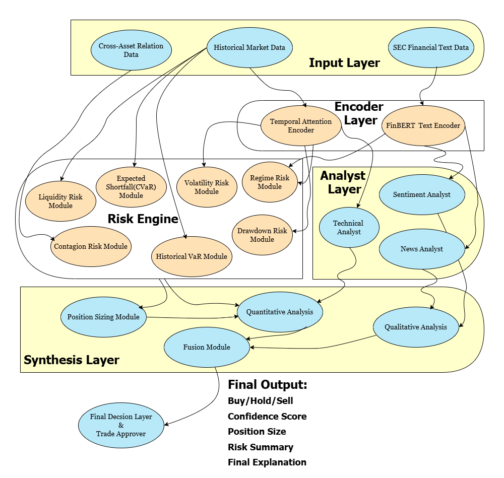

# Clean Architecture Blueprint

# 1. System idea

Your framework now has **three main intelligence streams**:

1. **Technical Market Stream**
   Learns temporal market behaviour using an **attention-based time-series encoder**.

2. **Text / Sentiment / News Stream**
   Uses **FinBERT** for financial text understanding.

3. **Fundamental Stream**
   Uses structured company financial data.

These streams feed into:

4. **Risk Engine**
   The most important control layer.

5. **Fusion Layer**
   Combines all outputs into a final decision.

6. **Trade Approval + XAI**
   Produces the final recommendation and explanations.

---

# 2. Exact stage-by-stage blueprint

## Stage 0 — Input layer

### Inputs

* **Time-series market data**
  Open, high, low, close, volume, returns, rolling indicators
* **Text data**
  News, filings, sentiment-bearing text, macro headlines
* **Fundamental data**
  Financial ratios, balance sheet data, earnings metrics
* **Cross-asset relation data**
  Correlation graph, sector links, market dependency graph

---

## Stage 1 — Data processing layer

## 1A. Technical encoder

### Model

**Shared Temporal Attention Encoder**

### Purpose

This is your main time-series encoder.
It should learn:

* temporal dependencies
* important time windows
* market behaviour patterns
* timing information

### Output

A latent market representation used by:

* Technical Analyst
* Volatility Model
* Drawdown Model
* Regime Model

### Practical note

Since you want attention but not a massive custom transformer stack, define this block as:

* **Temporal Attention Encoder**
* implemented either as:

  * lightweight transformer encoder
  * attention-augmented sequence model
  * fine-tunable pretrained temporal model if available
  * otherwise trained on your market history

That keeps your design honest and flexible.

---

## 1B. NLP encoder

### Model

**FinBERT**

### Purpose

Understands:

* sentiment
* event tone
* company-specific text meaning
* macro news effect

### Output

Feeds:

* Sentiment Analyst
* News Analyst
* Regime Model

---

## 1C. Fundamental encoder / model

### Model options

* MLP
* XGBoost
* LightGBM
* small tabular transformer if you want later

### Purpose

Understands:

* company quality
* valuation
* financial strength
* long-term investment potential

### Output

Feeds:

* Fundamental Analyst

---

# 3. Analyst layer

## 2A. Technical Analyst

Uses encoded market sequence to output:

* trend score
* momentum score
* timing score
* directional confidence

## 2B. Sentiment Analyst

Uses FinBERT outputs to determine:

* bullish / bearish sentiment
* sentiment confidence
* text-derived market mood

## 2C. News Analyst

Uses FinBERT outputs to determine:

* event relevance
* macro/company event impact
* risk relevance from news

## 2D. Fundamental Analyst

Uses structured company data to determine:

* intrinsic value signals
* quality of business
* undervaluation / overvaluation tendency

---

# 4. Risk engine

This is now the strongest part of your architecture.

## 3A. Volatility Estimation Model

### Input

Encoded time-series output

### Purpose

Estimate:

* current volatility
* short-term uncertainty
* instability of price movement

### Model suggestion

* first version: statistical + model hybrid
* later: larger sequence model if needed

### Output

Volatility risk score

---

## 3B. Drawdown Risk Model

### Input

Encoded time-series output

### Purpose

Estimate:

* likely downside from recent peaks
* depth of possible decline
* probability of severe fall

### Model suggestion

* LSTM or small sequence model is fine here

### Output

Drawdown risk score

---

## 3C. Value at Risk (VaR)

### Method

**Historical VaR**

### Purpose

Estimate threshold loss under historical distribution.

### Output

VaR score / cutoff

---

## 3D. Expected Shortfall (CVaR)

### Method

Historical CVaR

### Purpose

Estimate average tail loss beyond VaR.

### Output

Tail-risk severity score

---

## 3E. Correlation / Contagion Risk

### Model

**GNN-based relation model for risk propagation**

### Purpose

This is where your relational finance modeling lives.

It should capture:

* cross-asset dependency
* sector spillover
* market contagion
* hidden concentration risk

### Input

Cross-asset graph built from:

* rolling correlations
* sector / industry links
* maybe co-movement strength

### Output

Contagion / dependency risk score

---

## 3F. Liquidity Risk Model

### Input

Volume, turnover, maybe spread proxies

### Purpose

Estimate:

* ease of entering trade
* ease of exiting trade
* slippage risk
* practical tradability

### Output

Liquidity score / execution feasibility score

---

## 3G. Regime Risk Model

### Input

* Temporal attention encoder output
* FinBERT output

### Purpose

This model is now a **twin bridge** between market state and text state.

It should estimate:

* calm / trending / volatile / crisis regime
* whether the current market behaviour state is changing
* how much the environment changes trust in the signal

### Output

Market regime classification + regime confidence

---

## 3H. Position Sizing Engine

### Inputs

All risk submodule outputs:

* volatility
* drawdown
* VaR
* CVaR
* contagion
* liquidity
* regime

### Purpose

Convert risk into capital allocation logic.

### Output

Recommended:

* no trade
* reduced size
* standard size
* aggressive size only if justified

### Model suggestion

Do **not** start with a big learned model here.

Use:

* rule-based / constrained optimizer first
* later learned sizing if needed

This block must remain interpretable.

---

# 5. Analysis split

## Qualitative analysis

Comes from:

* Sentiment Analyst
* News Analyst
* Fundamental Analyst

These are your “reasoning-rich” or context-heavy signals.

## Quantitative analysis

Comes from:

* Technical Analyst
* All risk engine modules
* Position Sizing Engine

These are your numerical market and risk signals.

---

# 6. Fusion layer

You said you will discuss this later with your group, so I’ll keep it architecture-neutral but clean.

## Fusion Engine

### Role

Combine:

* qualitative analysis
* quantitative analysis

### Future implementation options

* learned fusion
* attention-based fusion
* rule-based fusion
* hybrid

### Output

* final trade score
* buy / hold / sell
* confidence
* trade size input to final approver

---

# 7. Final decision layer

## Final Trade Approver

Takes:

* decision
* confidence
* position size recommendation

Returns:

* final action

---

# 8. XAI layer

You already decided this correctly.

## XAI Layer produces:

* explanation from Technical Analyst
* explanation from FinBERT-based sentiment/news models
* explanation from Fundamental model
* explanation from each risk module
* explanation from fusion layer
* combined final explanation for user

---

# 9. Final output

The user sees:

* Buy / Hold / Sell
* Confidence
* Suggested position size
* Risk summary
* Key drivers behind the decision
* Module-wise explanation
* System-level fused explanation

---

# 10. Modules

* **Shared Temporal Attention Encoder**
* **FinBERT Financial Text Encoder**
* **Fundamental Analysis Module**
* **Technical Analysis Module**
* **Volatility Risk Module**
* **Drawdown Risk Module**
* **Historical VaR Module**
* **CVaR Tail Risk Module**
* **GNN Contagion Risk Module**
* **Liquidity Risk Module**
* **Regime Detection Module**
* **Position Sizing Engine**
* **Qualitative Synthesis Layer**
* **Quantitative Synthesis Layer**
* **Fusion Engine**
* **Final Trade Approver**
* **XAI Explanation Layer**

---

# 11. Final compact blueprint

```text
INPUTS
├── Historical Market Data
├── Financial Text Data
├── Fundamental Company Data
└── Cross-Asset Relation Data

ENCODERS
├── Shared Temporal Attention Encoder
├── FinBERT Financial Text Encoder
└── Fundamental Model

ANALYST MODULES
├── Technical Analyst
├── Sentiment Analyst
├── News Analyst
└── Fundamental Analyst

RISK ENGINE
├── Volatility Estimation Model
├── Drawdown Risk Model
├── Historical VaR
├── CVaR
├── GNN Contagion Risk Model
├── Liquidity Risk Model
├── Regime Detection Model
└── Position Sizing Engine

SYNTHESIS
├── Qualitative Analysis
├── Quantitative Analysis
└── Fusion Engine

DECISION
└── Final Trade Approver

EXPLAINABILITY
└── XAI Layer

OUTPUT
├── Buy / Hold / Sell
├── Confidence Score
├── Position Size
├── Risk Summary
└── Final Explanation
```


<br>

### Proposed architecture for an explainable distributed financial risk management framework integrating temporal market encoding, financial text understanding, fundamental analysis, multi-component risk estimation, fusion-based decision synthesis, and final explainability output.<br>
